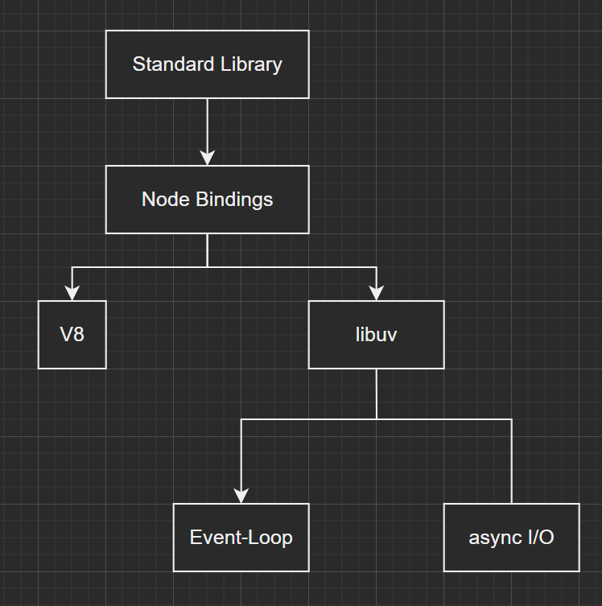
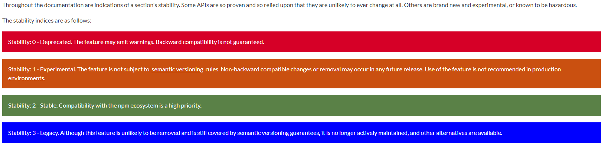
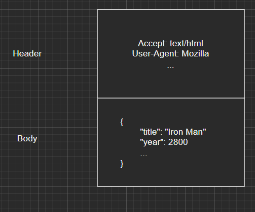
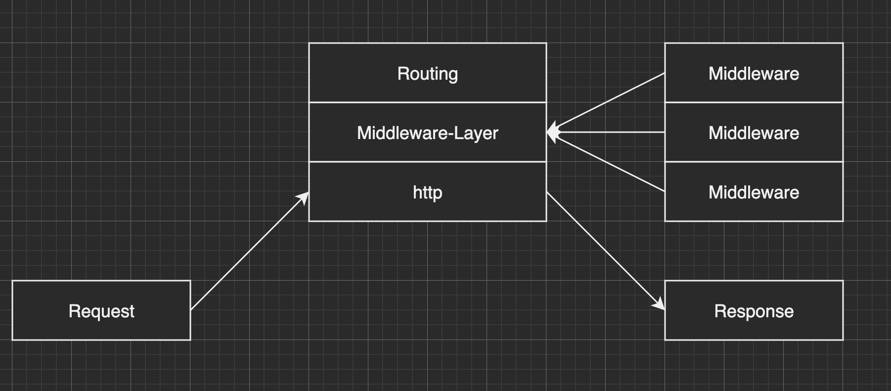
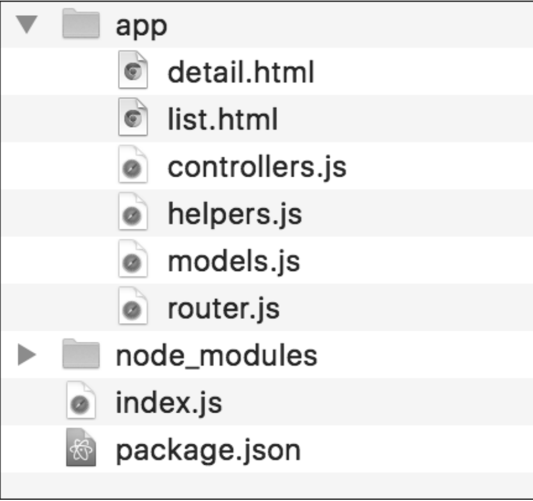
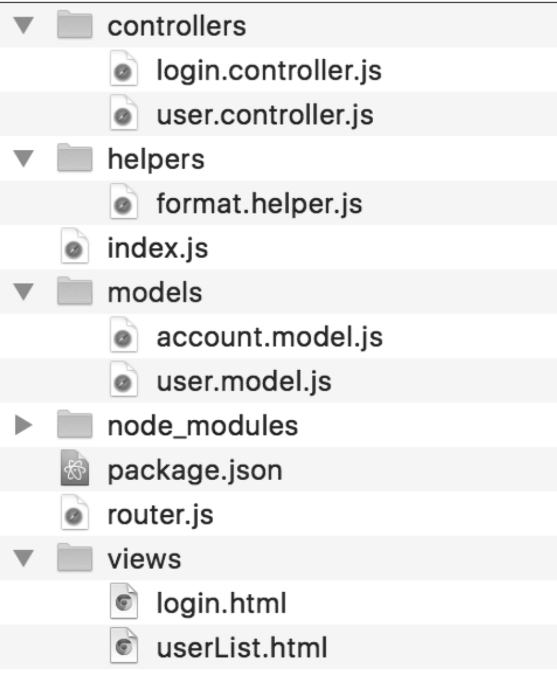
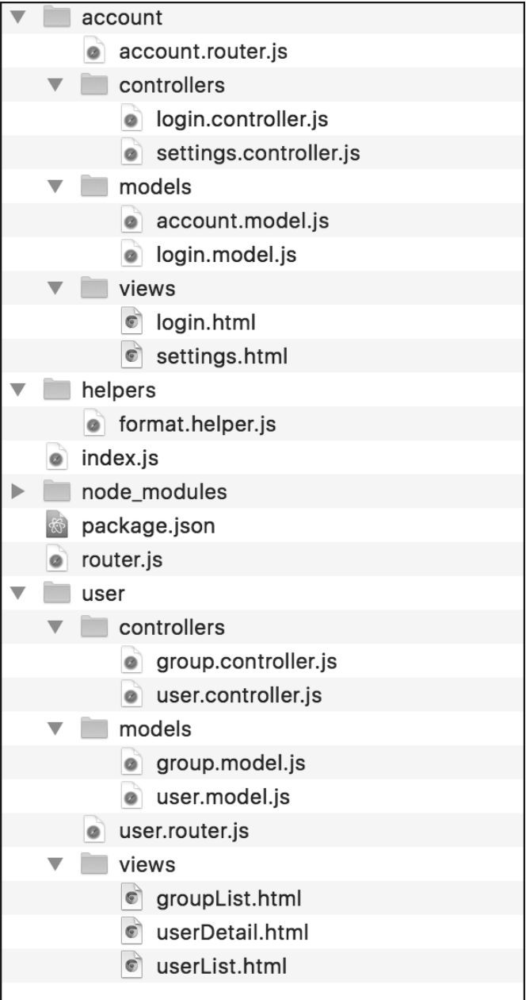

# Node - Das Umfassende Handbuch by Sebastian Springer, 4th. Edition

---

## 1. Basics
## 2. Installation
## 3. A first example
## 4. Node.js modules
## 5. HTTP
## 6. Express
## 7. Template-Engines
## 8. Connecting To Databases
## 9. Authentication and Session Management
## 10. REST-Server
## 11. GraphQL
## 12. Realtime-Web Applications
## 13. Typesafe Applications in Node.js
## 14. Webapplications with Nest
## 15. Node on the command line
## 16. Asynchronous Programming
## 17. RxJS
## 18. Streams
## 19. Working with files
## 20. Socket-Server
## 21. Package Manager
## 22. Quality Assurance
## 23. Testing
## 24. Security Packages
## 25. Scalability and Deployment
## 26. Performance
## 27. Microservices with Node.js
## 28. Deno

---

# 3. A first example

## Debugging

You can start debugging a node application using ```node inspect <file.js>```. 

### Debugger navigation

Here is a list of commands that you can use on the debugger:

|Command|Meaning|
|-------|-------|
|```c```|Continue|
|```n```|Step next|
|```s```|Step In|
|```o```|Step Out|
|```pause```|Pause|

### Information inside the debugger

You can use ```repl``` to open a repl inside the debugger that can use the current state of the application. Use ```strg+c``` to get back to the debugger after you're done with the repl.

You can also use ```list(x)``` to get to the ```x``` line of the source code.

With ```backtrace``` (or the shortcut ```bt```) you can get the backtrace of the subroutines that you've been inside of.

With ```watch(x)``` you can put a watch on a variable and see everything when something changes to it. Use ```unwatch(x)``` to stop watching the variable and ```watchers``` to see all the watchers.

### Breakpoints

You can set breakpoints directly from the debugger using ```setBreakpoint(x)``` (or the shortcut ```sb(x)```) to set a break point at line ```x``` in the source code.

Use ```clearBreakpoint(x)``` (or the shortcut ```cb(x)```) to clear a breakpoint at a certain line in the soure code.

You can also set breakpoints directly inside the source code using the ```debugger``` keyword:

```JavaScript
console.log("hello world 1");
debugger;
console.log("hello world 2");
```

The disadvantage is that you have to change the source code and after you're done debugging you have to remember to delete the ```debugger``` keyword from the source code.

### Debugging using Chrome Developer Tools

In order to debug using the Chrome Developer Tools you have to start the application using ```node --inspect <file.js>``` ( not ```inspect```, use the double-dashed version ```node --inspect```).

Afterwards you have to go to ```chrome://inspect``` and click in the ```INSPECT```-Link to add the port of your application.

## Nodemon

Whenever you are making a change to your node application, you always have to restart the server. 

You can automate this using ```nodemon <file.js>``` that can be installed with ```npm install -g nodemon```. Using this, whenver you change something to the source code, you won't have to restart the server to see them

# 4. Node.js modules

## Modular Structure

This is the structure of a node application:



The core of Node.js are the *V8 engine* and several other libraries like *```libuv```* or *```openssl```* that were written in C++.

*Node Bindings* is a layer that represents the connection between C++ and JavaScript.

The last layer of the Node.js platform, the *Standard Library* is build out of core-modules. You use this interface directly when buildling your application. The core modules have interfaces that work directly with your system.

Another interface of Node.js is the package-manager. 
A *module* is a library in Node.js that can be loaded an used in an application using the module system.
A *package* contains one or more modules that are bundled in one package. Packages can be installed using the package-manager.

The last layer of Node.js is your actual application. The application should implement a modular approach. Your application should be made out of smaller pieces that define interfaces that work with each other.

## The structure of an application

Modularisation is key for a maintainable and extensible application.

When implementing modularisation, **each module must have its own file** that only contains a couple of functions/objects/classes. **You must keep a consistant naming**. A folder should contain modules that are solving a certain problem by working together.

In order for your application to have a clean structure, you shouldn't have too many files inside a folder. **A good benchmark is 7 to 10 files in one folder**.

**Modularisation has the following advantages:**

* Reusability of sub-components
* Better testing
* Parallelizability during development due to the independence of the components
* Interchangeability of individual components through defined interfaces

## Core Modules

You can find the documentation of core modules [here](https://nodejs.org/api). In case you need more information, you can read the [source code](https://github.com/nodejs/node) in the folder *lib*. You can also use the unit tests for even more documentation.

The core modules are each exporting an object that lets you use the functionality of that module. You normally store the return value of the ```require``` function ( in case of CommonJS ) in a constant that represents the module that you want to use.

### Stability Index



## Activating the ECMA-Module System

There are three ways to activate the ECMA-Module System:

* *File extension ```.mjs```*: Node.js will take care of ECMA modules and activate it for you
* *```type```-field in ```package.json```-File*: Add the ```type``` field inside the ```package.json``` file with the value of ```module```. Afterwards, you can use the normal file extension ```.js```
* *```--input-type```-Flag*: Start the Node process with the option ```--input-type=module```.

## Global objects

The global objects can be seen on the [Node.js api documentation](https://nodejs.org/api/globals.html).

### File and folder name

Using the ```__filename``` and ```__dirname``` you can get the name of the file of the module and the name of the folder.

Even if you import the module somewhere else, the values of those two properties will still be accurate.

### Buffer

```Buffer``` objects are always used when working with binary files. Example:

```JavaScript
import { readFile } from 'fs';

readFile('input.txt', (err, data) => {
    console.log(data); // Output: <Buffer 48 61 6c 6c 6f 20 57 65 6c 74>
    console.log(data.toString()); // Output: Hello World
});
```

The most important methods of ```Buffer``` objects are ```toString``` which returns the value of the buffer in a string and ```write``` which allows you to add additional information into the buffer.

## The global scope

In client-side code you have block, function and closure scope and you also have the so-called *global* scope. You don't have a direct *global* scope in Node.js.

If you add something to the *global* object, this global property will be available inside the entire application (even outside the file).

Example:

```JavaScript
function createGlobal() {
    global.myName = 'Peter';
}

createGlobal();
console.log(myName);
```

## JavaScript Module Systems

### CommonJS

In Node.js there are no global variable in the module system unless you define them with the ```global``` object (read section above). You must export what you want to use somewhere else in the application.

A module isn't working alone, it's always part of a bigger application. Using ```module.exports``` you can define interfaces from your application that you want to be used in other modules as well.

Example:

```JavaScript
// add.js

module.exports = function(a, b) {
    return a + b;
}
```

Modules are represented by files that are loaded using the ```require``` method. This function returns an boject that represents the public interface of the file. You can use the functionality of the module through this object.

```JavaScript
// index.js

const add = require('./add.js');

const result = add(1, 2);
console.log(`result: ${result}`);
```

### ECMA-Script

This works just like client-side code. The important difference is how Node.js activates the ECMA-Module System (read section above, there are 3 ways).

### Modules in Node.js

Modules have to be structure in the following way: ***one structure, one file.***
This means that all logical units of your application are located in their own files. **Each file is used to solve a certain problem and it only contains one interface**. By implementing this philosophy you will see that it is very easy to structure and locate certain components in your application.

Normally, when you build your application, you group your modules thematically. When outsourcing code blocks that are used multiple times, the art is to find the right degree between generalization and effort. As a guideline, you should always primarily solve your current problem and only generalize as much as is necessary for your application. If you write code that is too general, it will automatically become more complex, harder to read, and more costly to implement.

#### Loose Coupling, Tight Cohesion

This type of modularization follows the principle of loose coupling. This means that the structures, i.e. functions, objects or classes, of an application are only loosely connected via interfaces. 

The components of the individual modules must be closely connected on the other side. This means that only the logic that can really be assigned to the topic of the module is accommodated in a module. Everything else is in turn separated into its own modules and addressed via interfaces.

## The ```modules```-Module

The ```modules``` module represents the CommonJS-Module Loader. You can't use this module loader in combination with ECMA Script Modules.

An important component of this module is the ***```modules.exports```-Object*** that you can use to make modules public. Another important component is the ***```require```-function*** that can be used to import certain components from other modules.

The ```module``` object is a global object. You can't use it however, if you've activated the ECMA-Script Modules.

The ```module``` object also contains the ```module.id``` and ```module.filename``` properties that contain the absolute filename of the module.

You can see if the module has been completely loaded by using the ```loaded``` property of the ```module``` object.

When a Node.js application is launched, the ```require.main``` property is automatically filled with the module object of the initial file. This means that you can access the filename of the file that serves as the entry point to your application in any module via ```require.main.filename```.

The parent property of the module object provides information about the module that loaded the current module. This information is inside an object that has the same type as the ```module``` object.

In the property ```children``` you get an array of modules that were loaded with ```require```.

## Resolution of NPM-Modules

When searching for NPM modules, the CommonJS module loader and the ECMAScript module loader behave the same. You load NPM modules by prepending neither ```/``` nor ```./``` to the module you want to load.

In this case, the module loader either searches for a Nodejs. core module, or it searches for a package with the corresponding name in the node_modules subdirectory in the current directory. If the package is not found there, it tries one level higher to resolve the patekname.

The module loader will go for example from ```/projects/project1/node_modules``` to ```/project/node_modules``` up to the root folder. It will also search all the paths in the ```NODE_PATH```. It will also search ```<home>/.node_modules```, ```<home>/.node_libraries``` and ```<install-prefix>/lib/node````.

## The module cache

Whenever you are loading a module, it is loaded inside the module cache. If you are loading the module again somewhere else in the application, it will be directly taken from the module cache. This greatly improves the performance of the application since you don't have to wait for a module to be loaded more than 1 single time.

## The ```require``` functionality

Using the ```resolve``` method from the ```require``` object you can find the file where a module is saved.

You can use the ```cache``` property of the ```require``` object to read and modify data from the cache. The ```cache``` object is a normal JavaScript object. The keys are the absolute files paths of the modules and the values are the respective ```module``` objects.

There are no core modules inside the cache.

This is how you can for example 'reload' the cache (read *The module cache* section above).

```JavaScript
// my_module.js

console.log("Hello world");
```

```JavaScript
// index1.js
require("./my_module"); // output: Hello world
require("./my_module"); // output: no output
```

```JavaScript
// index2.js
require("./my_module"); // output: Hello world
delete require.cache[require.resolve('./my_module')];
require("./my_module"); // output: Hello world
```

# 5. HTTP

## HTTP Web Server

Here is an example of an HTTP Web Server:

```JavaScript
import { createServer } from 'http';

createServer(
    (request, response) => {
        response.writeHead(200, {
            'content-type': 'text/html'
        });

        const responseBody = `
        <!DOCTYPE html>
        <html>
            <head>
                <title>Adressbuch</title>
            </head> 
            <body>
                <h1>Adressbuch</h1>
            </body>
        </html>
        `;
        response.end(responseBody);
    }
).listen(8080, () => {
    console.log("Adressbuch erreichbar unter http://localhost:8080");
});
```

You are using the method ```createServer``` from the ```http``` module to build a server. The server then takes a callback that is executed every time a request is made to the server.
The response then writes the head with a 200 status code and the content-type is set to html since the body of the response will be html code. The response is then ended and sent with the html code.

Here is an overview of what the methods do:

* ```createServer```
    * This builds an instance of the ```Server``` class. It's the same as building an instance of ```Server``` using the ```new``` keyword. The callback function given to ```createServer``` is sent to the ```request```-Event of the Server. 
* ```listen```
    * The server starts listening for connections on the given port.
* ```write```
    * You write a part of the body. You can use this multiple times for each response.
* ```end```
    * You signal to the client that it has received the full message from the server. If you don't use this method, the client will stop the connection after a pre-defined configured time period.

You can give thte ```listen``` method a TCP-Port and the server will listen to all IPv6-interfaces that have the given port. If IPv6 is not available, IPv4 will be used. 

If the given port number is 0, the server will listen only listen to a certain port that you can access using the ```address``` function of the Server object. You can also give a specific host name to which the server can connect to.

The third argument of the ```listen``` method is the length of the queue of the server for incoming connections. The default value is *511*.

Regardless of the number of arguments that are given to the ```listen``` method, if you give it a callback, that callback will be executed when the Server has successfully connected. This callback method is usually used to given a signal to the users that the server is now waiting for incoming connections.

If you have used the ```listen``` method to a Server, then the Server is going to wait for incoming connections. You can close the Server using the ```close``` method of the Server object.

The methods ```write``` and ```end``` also accept ```Buffer``` objects. The default encoding is ```utf8```. The ```writeHead``` method is writing the head info. If you didn't execute ```writeHead``` before ```write```, then ```write``` will automatically write the head information for you. 

If the ```write``` method returns ```true```, that means that the message has been sent successfully. If it returns ```false``` then that means that the message was put in a queue. When the buffer is free again, the ```drain```-Event will be dispatched.

You can add HTTP trailing headers using the ```addTrailers``` method.

### Server Events

The following table represents some events that a server can react to:

|Event|Description|
|-----|-----------|
|```request```|Incoming client request|
|```connection```|A connection was built with a client|
|```close```|The server is closing|
|```checkContinue```|This event is dispatched when the Server receives a request with an ```Expect: 100-continue```-Header and the Server has to respond with the status code 100|
|```checkExpectation```|This event is dispatched when the Server recieves a request with an ```Expect```-Header that doesn't have the value ```100-continue```. If this event dispatching callback function is not implemented then the Server will respond with ```417 Expectation Failed```|
|```connect```|A client makes a request to the server using the ```CONNECT``` HTTP Method|
|```upgrade```|A client makes a request to the server using the ```UPDATE``` HTTP Method|
|```clientError```|A client has sent an error message|

### The ```request``` object

This is how an HTTP-Request is built:



The header contains meta-information like for example in what format the response of the server should be. It contains key-value pairs that are defined in the HTTP-Standard.
The body contains the data of the request. The body doesn't always contain data.

### The properties of the ```request``` object

The client uses the ```request``` object to tell the Server what he has to do. The header information of the request is inside the ```request``` object and the body is sent as a stream of multiple data packages. The ```request``` object must be seen as a read-only-object.

This are the most important properties of the ```request``` object:

* ```method```
    * This is the HTTP method that the client has sent and describes what the Server must do with the requested resources. The value of this property can be ```GET```, ```POST```, ```PUT```, ```DELETE```, ```HEAD```, ```PATCH```, ```TRACE```, or ```OPTIONS```
* ```url```
    * The url from where the request was made
* ```header```
    * The HTTP header contains key-value pairs of meta information of the request. If the ```Accept```-Header is for example ```application/json``` that means that the client is expecting a JSON structure from the server.
* ```trailers```
    * The counterpart of headers are trailers.
* ```httpVersion```
    * The http version of the request
* ```connection```
    * This property gives you access to the socket-object that was used for the communication between the Server and the Client.

### HTTP Status Codes

The status codes represents the status of the request.
Status codes can be put into 5 groups and each group has a different meaning:

* *1xx*: informational response
* *2xx*: success
* *3xx*: redirection
* *4xx*: client errors
* *5xx*: server errors

### The ```writeHead``` method

The easiest way to define a correct response-header is to use the ```writeHead``` method. The ```writeHead``` method normally takes 2 arguments. The first argument is a number that represents the *status code* and the second one is the *object with the header information*. You can only use this method once and then you can't change the header information. You must execute this method before ```write``` or ```end```.

You can also use the property ```statusCode``` and the method ```setHeader``` to set a status code and a header for the ```response``` object. The first argument of ```setHeader``` is the name of the field and the second one is the value. If you want to change the header information of a header use ```getHeader``` to read the value of a header and ```removeHeader``` to delete a information from the header.

### How body data is processed

Header information is taken directly from the request object. However, the information from the body is taken from a data stream that contains multiple packages. The request can contain multiple so-called *Chunks* of data. When a part of the request is ready to be read, the *```readable```-Event* is dispatched. You can use the ```read``` method inside the handler-function to read the chunk of data that was received from the data stream. When the request is ended, the *```end```-Event``` is disptached.

## Node.js as Client

### Requests with the ```http```-Module

In order to make a request, you must provide the ```request```-function with a configuration object and a callback function that will execute as soon as you receive a response.

Example:

```JavaScript
import {
    request
} from 'http';

const options = new URL("https://jsonplaceholder.typicode.com/posts");

request(
    options,
    response => {
        let body = '';
        response.on(
            'data',
            chunk => body += chunk
        );

        response.on(
            'end',
            () => console.log(body)
        );
    }
)
```

The reponse is given again as a data-stream. You can use the data using the ```data```-Event. When the response is ended, the ```end```-Event is dispatched. When the ```end```-Event is dispatched, you can fully process the complete response.

You can also use the ```get``` function of the ```http``` module instead of the ```request``` function. By using the ```get``` function you can also define your intensions better.

### The ```request``` package

An alternative of the ```request``` function is the ```request``` package that you can install with ```npm install request```.

This is how you make a get-request to a server using the ```request``` object:

```JavaScript
import request from 'request';

request(
    'https://jsonplaceholder.typicode.com/posts',
    (err, response, body) => {
        console.log(body);
    }
)
```

The following is an example of a post-request:

```JavaScript
import request from 'request';

const post = {
    "userId": 1,
    "id": 101,
    "title": "Test title",
    "body": "Test body",
}

request.post(
    {
        url: 'https://jsonplaceholder.typicode.com/posts', 
        post
    },
    ( err, response, body ) => {
        if (err) {
            console.error(err);
        } else {
            console.log(body);
        }
    }
)
```

# 6. Express

## Express Structure



The ```http``` module builds the fundamental of Express.

Express uses so-called middleware functions that are executed during the request-response-cycle of Express. You can use middleware functions given by Express or you can make your own. There are also third-party middleware functions.

The third layer of the architecture of Express is the Router. This component executes the right function depending on the URL from where the client made his request so that the client can get a proper response back.

## Express basics

A request comes from a client to the express-server. Depending on the ```http```-method and of the URL-Path a certain router will be chosen and express executes a certain number of callback functions. Inside this callback functions you have access to the ```Request``` and the ```Response``` objects. This two objects with the Router and the Middleware functions are buildling the core of Express.

## The ```Request``` object

The ```Request```-object is the first argument given to a routing-callback-function and represents the request that comes from the client to the Express-server.

Here are the most important properties of the ```Request``` object:

|Property|Description|
|--------|-----------|
|```method```|This is the HTTP-Method (e.g. ```GET```, ```POST```, etc. )|
|```originalUrl```|This is the url from where the Request was sent.| 
|```params```|This property contains all the parameters of the Request (e.g. ```request.params.id=5```, etc.)
|```path```|This property contains the path of the URL|
|```protocol```|The protocol of the Request (e.g. HTTP or HTTPS)|
|```query```|The query string that is part of the URL.|

You can read *header fields* with the ```get``` method. The method is *not* case-sensitive. If you are interested for example in the ```Content-Type``` header-field use ```req.get('Content-Type')```.

## The ```Response``` object

The ```Response``` object is the second argument given to routing-callback-fucntions and represents the response that is being sent back to the client.

The most important property is ```headersSent``` which is a boolean. If this property is ```true``` that means that the headers have already been sent and you can't change them.

These are the most important methods of the ```Response``` object:

|Method|Description|
|------|-----------|
|```get(field)```|Reads the given header-field of the response|
|```set(field, [,value])```|Sets the header-field to a specific value.|
|```cookie(name, value, [, options])```|Sets a value to the cookie|
|```redirect([status, path])```|Redirects the request to a different path|
|```status(code)```|Sets the status code of the response|
|```send([body])```|Sends the body of the response|
|```json([body])```|Sends the body of the response. The body is an object that is transformed into a json object|
|```end([data][, encoding])```|Sends the body of the response. You should use this method primarily if you are not sending user data such as HTML structures. Otherwise, use the ```send```-method|

## Setup

It's better to structure your application in smaller components. In that way you can develop it faster and you can work in teams faster, bugs are easier to solve and the structure of the application is much more clearer. Usually, for Express applications you can use the MVC-Pattern:

### MVC

*Model*: The model is the component that holds the data. This components also contains methods that allow you to change the data (adding, deleting, modifying data). The model components are usually connected to a database and they also contain the business-logic.
*View*: The view components render the data to the user. They are usually HTML-Templates.
*Controller*: The controller connects the model components with the view components. They aren't allowed to be too big and shouldn't contain any logic at all (if possible). If a controller contains too much logic, you should think about putting that logic inside a model/view-component.

### Structure of an application

The structure of an application depends very much on how big it is. Usually, at the beginning of an application so you don't really have to think about it. You shouldn't try to optimize the structure of an application when starting, you can refactor it later.

### Structure of a small application

For very small apps, build a file for every component:



This structure however works for very small apps that means *3 to 4 endpoints*.

### Structure of a medium application

For medium applications, meaning *10 to 15 endpoints* you can build different routes. In this type of applications you should have different folders for models, views and controllers.

In order to categorize the files properly you can put the type of the controller inside the filename. If you are buildilng a controller for the login process, you can name the controller ```login.controller.js``` so that you know what the controller is responsible for.



### Structure of a big application

A bigger application should be built out of multiple modules where each module is responsible for a certain thing. The module then contains different folders for controllers, models and views:



## The ```index.js``` file

The ```index.js``` file represents the start of an application. Make sure to remember that this file is only for initialization and nothing else. This file shouldn't be responsible for anything.

## Routing

Example of routing:

```JavaScript
import express from 'express';
import { router } from './movie/index.js';

const app = express();

app.use('/movie', router);
```

Use the ```use``` method to set up a router on a certain path. The router can then set up ```GET```, ```POST``` callbacks just like the object ```app``` does. The difference is the path.

Routers can restrict other routes from being executed since the first route found is also executed. If you have multiple routes that are the same, only the first one found will be executed, while the rest will be ignored.

## Middleware

A middleware function is a function that is exectued during the request-response-cycle. That is the time between when the request has been sent from the client and when the response has been sent to the client. You can chain this functions together. There already are middleware functions given by Express that you can use or third-party middleware functions but you can also write your own.

### Writing your own middleware

A middleware function has a certain signature. The first argument is the request of the client, the second argument is the response that will be sent to the client and the third function is the so-called ```next```-function which is just another callback function that is being passed to the function. It doesn't have to be named ```next```, it's just a convention. If you forget to call the ```next``` function then you will stop the chain.

Example:

```JavaScript
import express from 'express';

const app = express();

// Writing the middleware function
const log = (request, response, next) => {
    console.log('this is a logger.');
    next();
}

// Registering the middleware function in the chain
app.use(log);
```

The signature of middleware functions is the same as the routing functions. A middleware function always takes in the request, response and the callback function.

The ```next``` callback function given to the middleware function calls the next middleware function and so on. If you don't call this function the chain of middleware functions will end.

You have to register the middleware function using the ```use``` method. This method also receives an optional first argument that represents the URL where the middlware function has to be executed. If no optional URL is given, the middleware function will be used for every URL. The order in which you register the middleware functions is important too. Throughout the chain of middleware functions, you always receive a reference to the request and response objects.

## Static data

If you want to load static data using Express, use the middleware function ```express.static``` that takes in the URL of the static data:

```JavaScript
app.use(
    express.static(/* url */)
);
```

## Taking in values in URLs

If you want to take in an argument in an url use ```:```:

```JavaScript
router.get('/delete/:id');
```

If the value is optional add a question mark:

```JavaScript
router.get('/delete/:id?');
```

You can now get the ```id``` using ```request.params.id```. Keep in mind that the values taken from the user are always strings.

# 7. Template-Engines

## The basics of template engines

A template is a static structure ( usually an HTML document ) that contains markers that help you dynamically change the templates with certain values.

These are the advantages of template engines:

* **Separation of logic and markup**: Mixing HTML and JavaScript code in an application degrades the readability of the source code on both sides and thus also has a negative impact on the maintainability of the entire application. For this reason, it makes sense to separate the presentation and the application logic as much as possible. Template engines contribute to this by giving you as a developer the possibility to write templates without logic and to insert the dynamic parts via markers.
* **Reusability**: Many template engines have features that allow you to subdivide templates to define blocks, called partials, and then dump them into separate files. Partials can be used multiple times in your application. This reusability ensures that you can make changes to the appearance of your application more quickly and conveniently.
* **Parallelization of work**: With a template engine, you can separate the work on the frontend and backend of your application and parallelize the work. When a feature is implemented, one developer can deal with the controllers and models that need to be implemented. In the meantime, other developers can take care of implementing the templates and frontend logic. Both teams coordinate on the interface between controller and template and agree on which variables are available.

There are also disadvantages when it comes to template engines. The processing of the templates by the application, i.e. searching and replacing the markers, requires time and resources. However, there are solutions for this problem as well in the form of precompiling and caching.

Instead of using template strings, you can also implement such a template engine by using markers in your template and then replacing them with dynamic content using the String-```replace``` method. Markers in this case are specially marked strings. Usually, special characters such as curly braces are used here, resulting in markers such as ```{{movie}}```.

Basically, there are two things you should keep in mind about template engines:

* Template editing takes time and resources, whether you use your own implementation or an existing engine. The templates need to be processed.
* Template-Engines are very hard.

## Pug

### Installation

The ```pug``` package is an open-source project on github and can be installed with ```npm install pug```.

### Pug Integration

In order to integrate pug in your application after you've downloaded it using ```npm``` you must add it first in the initialization file:

```JavaScript
// Inside index.js

app.set('view engine', 'pug');
```

Using ```app.set('view engine', 'pug')``` you make sure that Express changes the standard Template-Engine to ```Pug```. Now you can use the ```render``` method of the ```Response```-object to render templates.

The ```render``` method expects to find the templates in a folder called ```views```. You can change this behavior using ```app.set('views', './templates')``` and change the default template-folder to be ```./templates```.

The connection of a template engine to Express takes place through a method with the name ```__express``` in the respective Tempate engine. So Pug implements this method and then calls its own renderFile method. So if you want to bind to another template engine, you just need to make sure that such a method is implemented, and you are not limited to Pug.

### Pug Example

This is an example of the Pug syntax:

```Pug
doctype html
html(lang="en")
    head
        meta(charset="UTF-8")
        title Movie List
        link(rel="stylesheet" href="/style.css")
    body
        table
            thead
                tr
                    th Id
                    th Title
                    th Year
                tbody
                    tr
                        td 1
                        td Iron Man
                        td 2008
                        td
                            a(href="/movie/delete/1") Delete
                        td
                            a(href="/movie/form/1") Modify
        a(href="/movie/form") New
```

The first word of a line must be the tag. You can place more elements inside other elements using indendation. The attributes of elements are written in parentheses.

This is how you can modify the rendering in the controller in order to use the Template:

```JavaScript
export async function listAction(request, response) {
    const data = await getAll();
    response.render(
        `${dirname(fileURLToPath(import.meta.url))}/views/list`
    );
}
```

### Variables in Pug

In order to set up variables in Pug, you must give the values inside the ```options``` argument of the ```render``` method:

```JavaScript
export async function listAction(request, response) {
    const data = await getAll();
    response.render(
        `${dirname(fileURLToPath(import.meta.url))}/views/list`,
        {
            movie: data[0]
        }
    );
}
```

By using so-called *interpolation* you get access to the object from the Template using the ```#{variable}``` syntax. You can also add logic to the template but the whole philosophy of Templates is the separation of logic and markup. This is how you can change the template now:

```Pug
doctype html
html(lang="en")
    head
        meta(charset="UTF-8")
        title Movie List
        link(rel="stylesheet" href="/style.css")
    body
        table
            thead
                tr
                    th Id
                    th Title
                    th Year
                tbody
                    tr
                        td #{movie.id}
                        td #{movie.title}
                        td #{movie.year}
                        td
                            a(href="/movie/delete/1") Delete
                        td
                            a(href="/movie/form/1") Modify
        a(href="/movie/form") New
```

### Pug commands

|Command|Description|
|-------|-----------|
|```tag.myClass```|Build a tag with the ```class``` attribute ```myClass```|
|```tag#myId```|Build a tag with the ```id``` attribute ```myId```|
|```tag(href="www.google.de")```|Build a tag with the ```href``` attribute ```www.google.de```|
|```tag text | more text```| The ```|```-sign shows that the text will go on the next line as well|
|```${1+1}```|This command will be interpreter as JavaScript code and the output will be put inside the Template|
|```-for(let i = 0 ; i < 10 ; i++)```|Everything that comes after ```-``` is interpreted as JavaScript code but the output won't be shown|
|```// Comment```|This is a comment|

### Pug Extends and Includes

With Extends and Includes you can create reusable blocks and then assemble them into larger templates. Extends start from a base template into which specific blocks are overwritten. Includes works in the opposite way, integrating other sub-templates into a template.

Here is an example of building a ```block```:

```Pug
// base.pug
doctype html
html(lang="en")
    head
        meta(charset="UTF-8")
        title Movie list
        link(rel="stylesheet" href="/style.css")
    body

    img.logo(src="logo.png" height="50")

    block content
        div No Content
```

Now you can take ```base.pug``` and extend another template with it and also override the ```block content```:

```Pug
extends ../../templates/base

block content
h1 Movie Database
table
    thead
        tr
            th Id
            th Title
            th Year
        tbody
            - for(let movie of movies)
                tr
                    td #{movie.id}
                    td #{movie.title}
                    td #{movie.year}
                    td
                        a(href="/movie/delete/" + movie.id) Delete
                    td
                        a(href="/movie/form/" + movie.id) Modify
a(href="/movie/form") New
```

If you want to use ```block``` content in multiple templates, you must use ```include```.

Example:

```Pug
// list-item.pug
tr
    td #{movie.id}
    td #{movie.title}
    td #{movie.year}
    td
        a(href="/movie/delete/" + movie.id) Delete
    td
        a(href="/movie/form/" + movie.id) Modify
```

You can now use this template and include it somewhere else. This type of reusable templates are put in a separate folder.

```Pug
// list.pug
extends ../../movie/views/base

block content
    h1 Film Database
    table
        thead
            tr
                th Id
                th Title
                th Year
                th
                th
        tbody
            tr
                - for(let movie of movies)
                    include ./list-item
    a(href="/movie/form") New
```

### Pug Mixins

Pug mixins are just like functions. They can take in arguments. The output of a mixin is a Template-Block.

Example:

```Pug
// list-item.pug
mixin listItem(movie)
    tr
        td #{movie.id}
        td #{movie.title}
        td #{movie.year}
        td
            a(href="/movie/delete/" + movie.id) Delete
        td
            a(href="/movie/form/" + movie.id) Modify
```

You can now include this mixin somewhere else:

```Pug
// list.pug
extends ../../movie/views/base
include ./list-item

block content
    h1 Film Database
    table
        thead
            tr
                th Id
                th Title
                th Year
                th
                th
        tbody
            tr
                - for(let movie of movies)
                    +listItem(movie)
    a(href="/movie/form") New
```

## Using Pug outside of Express

Pug can also be used outside of Express:

```JavaScript
import pug from 'pug';

const template = 'h1 Hello World';
const output = pug.render(template);

console.log(output);
```

In addition to the render method, there is also the renderFile method. This method allows you to save the template to a separate file. Basically, it works like the render method, except that you pass it the name of the template file instead of a template string.

## Compiling

To load this template, Pug current uses the readFileSync method. This function blocks the execution of the rest of the source code, waiting for the read operation to finish. However, this does not matter in pug especially if templates are used several times, because the template engine keeps a cache of previously used templates. Pug divides the process of template processing into two parts. First, the tempalte is prepared in the compile process.  The placeholders are then inserted into this compiled template. Pug performs the compile operation only once for each template. All further uses of the templates are served from the cache. You can also use this feature directly, for example by using the ```compileFile``` method.

## Handlebars

The Templates in handlebars are just written in plain HTML. Handlebars doesn't have its own templating-language.

This template engine is very small and it doesn't have a lot of built-in functions.

### Handlebars integration in Express

In order to integrate handlebars you must install it first using ```npm install handlebars``` and, as previously mentioned in ```Pug```, a Template-Engine that has to be used in Express must chave the ```__express```-Method. Handlebars doesn't have that method, but there is a workaround: you can install ```express-handlebars```: ```npm install express-handlebars```.

This is how you can integrate handlebars:

```JavaScript
import expressHandlebars from 'express-handlebars';

app.engine('handlebars', expressHandlebars());
app.set('view engine', 'handlebars');
app.set('views', [`${dirname(fileURLToPath(import.meta.url))}/views/list`]);
```

You must register the ```express-handlebars``` function (the actual template-engine) to express using ```app.engine('handlebars', expressHandlebars());```. You must set the ```view engine``` to ```handlebars``` just like we did with ```Pug``` so that Express changes its standard template-engine with ```handlebars```.
With ```app.set('views', [`${dirname(fileURLToPath(import.meta.url))}/views/list`]);``` you make handlebars look into ```movie/views```-folder for the templates.

You now have to render the ```Response``` object inside the controller using handlebars:

```JavaScript
response.render(
    'list',
    {
        layout: false,
        movie: movies[0]
    }
);
```

You must give the name of the file as the first argument so that the response will render a file called ```list.handlebars```. You can also give other arguments to the ```options``` argument from the ```render```-method. ```layout:false``` means that handlebars won't use its standard template.

This is an example of the handlebars template:

```html
<!DOCTYPE html>
<html lang="en">
<head>
    <meta charset="UTF-8">
    <meta http-equiv="X-UA-Compatible" content="IE=edge">
    <meta name="viewport" content="width=device-width, initial-scale=1.0">
    <title>Movie List</title>
</head>
<body>
    <table>
        <thead>
            <tr>
                <th>Id</th>
                <th>Title</th>
                <th>Year</th>
            </tr>
        </thead>
        <tbody>
            <tr>
                <td>{{movie.id}}</td>
                <td>{{movie.title}}</td>
                <td>{{movie.year}}</td>
            </tr>
        </tbody>
    </table>
</body>
</html>
```

### Conditionals and Loops

You can extend the functionality of handlebars using so-called helpers. These are functions that you can execute from your templates. Some of the most important helpers are an integral part of Handlebars, for example the ```each``` helper, which allows you to iterate over data structures.

You can give a data-structure to the ```render``` method and then iterate over it inside the template:

```JavaScript
// controller.js

response.render('list', {layout: false, movies});
```

```HTML
{{#each movies}}
    <tr>
        <td>{{this.id}}</td>
        <td>{{this.title}}</td>
        <td>{{this.year}}</td>
    </tr>
{{/each}}
```

You can access the values that you iterate over using the ```this``` keyword.

## Partials

Partials are parts of templates that can be reused in different parts of your application. You can register a partial in handlebars using the ```registerPartial```-method. You can also register them manually.

Here is an example of a part of a template ( a partial ) that we will reuse later:

```HTML
<!-- list-item.handlebars -->
<tr>
    <td>{{this.id}}</td>
    <td>{{this.title}}</td>
    <td>{{this.year}}</td>
    <td>
        <a href="/movie/delete/{{this.id}}">Delete</a>
    </td>
    <td>
        <a href="/movie/form/{{this.id}}">Modify</a>
    </td>
</tr>
```

We can now implement this in our controller:

```JavaScript
// controller.js

import handlebars from 'handlebars';
import {
    readFileSync
} from 'fs';
import {
    dirname
} from 'path';
import {
    fileURLToPath
} from 'url';

const listItem = handlebars.compile(
    readFileSync(
        `${dirname(fileURLToPath(import.meta.url))}/views/list-item.handlebars`,
        'utf-8'
    )
);

export async function listAction(request, response) {
    const movies = await getAll();

    response.render(
        'list', {
            layout: false,
            movies,
            partials: {
                listItem
            }
        }
    );
}
```

Now we can implement the partial inside the main handlebars template:

```JavaScript
<!DOCTYPE html>
<html lang="en">
<head>
    <meta charset="UTF-8">
    <meta http-equiv="X-UA-Compatible" content="IE=edge">
    <meta name="viewport" content="width=device-width, initial-scale=1.0">
    <title>Movie List</title>
</head>
<body>
    <table>
        <thead>
            <tr>
                <th>Id</th>
                <th>Title</th>
                <th>Year</th>
            </tr>
        </thead>
        <tbody>
            {{#each movie}} {{>listItem}} {{/each}}
        </tbody>
    </table>
</body>
</html>
```

### Building Custom Helpers

You can build your own helpers in handlebars and use them inside your templates. You must register the helpers when buildling the template-engine inside the initialization file:

```JavaScript
// index.js

app.engine(
    'handlebars', 
    expressHandlebars({
        helpers: {
            uc: data => data.toUpperCase(),
        }
    })
);
```

You can now use this inside your templates:

```HTML
<!DOCTYPE html>
<html lang="en">
<head>
    <meta charset="UTF-8">
    <meta http-equiv="X-UA-Compatible" content="IE=edge">
    <meta name="viewport" content="width=device-width, initial-scale=1.0">
    <title>Movie List</title>
</head>
<body>
    <table>
        <thead>
            <tr>
                <th>{{ uc 'Id' }}</th>
                <th>{{ uc 'Title' }}</th>
                <th>{{ uc 'Year' }}</th>
            </tr>
        </thead>
        <tbody>
            {{#each movie}} {{>listItem}} {{/each}}
        </tbody>
    </table>
</body>
</html>
```

# 8. Connecting To Databases

## MySql

If you want to connect your express app to a MySql Database, use the ```mysql2``` package ( ```npm install mysql2``` ).

This is an example of how to use it:

```JavaScript
import mysql from 'mysql2/promise';

const connection = await mysql.createConnection({
    host: 'localhost',
    user: 'root',
    password: 'password',
    database: 'movie-db'
});

await connection.connect();

export async function getAll() {
    const query = 'SELECT * FROM Movies';
    const [data] = await connection.query(query);
    return data;
}
```

The majority of the functionality of the driver is based on ```Promise``` objects. You can stop the connection to the database using the ```end``` method.

The ```query``` method returns a Promise that resolves into an array with multiple elements.

If you want to insert values into a MySql database you can't use direct string concatenation, you must give the placeholder of the values and the values separately to the driver so that the driver can properly escape them. This is how you can avoid SQL Injections:

```JavaScript
async function insert(movie) {
    const query = 'INSERT INTO Movies (title, year) VALUES (?, ?)';
    const [result] = await connection.query(query, [movie.title, movie.year]);
    return {
        ...movie,
        id: result.insertId
    };
}
```

## SQLite

Use the ```sqlite3``` package.

## ORM

There are multiple ORM libraries, like Sequelize, Waterline or ORM2. Since ORMs add a level of abstraction between you and the database you can use ORMs with different database dialects since they will do all the work for you in the background. Usually when you install an ORM you also install the database driver that you want to use the ORM with.

Example of Sequelize (```npm install sequelize sqlite```):

```JavaScript
import {
    Sequelize
} from 'sequelize';

const sequelize = new Sequelize({
    dialect: 'sqlite',
    storage: './movie.db'
});

const Movies = sequelize.define(
    'Movies', {
        title: {
            type: Sequelize.STRING,
        },
        year: {
            type: Sequelize.INTEGER
        },
    }, {
        timestamps: false
    }
);

export function getAll() {
    return Movies.findAll();
}

export function get(id) {
    return Movies.findByPk(id);
}

export function remove(id) {
    return Movies.destroy({
        where: {
            id
        }
    });
}

export function save(movie) {
    return Movies.upsert(movie);
}
```

## Redis

Use the ```redis``` package (```npm install redis```).

## MongoDB

Use the ```mongodb``` package (```npm install mongodb```).

# 9. Authentication and Session Management

PassportJS is a modular authentication system that uses so-called strategies that can be plugged into the system. 

## Setup and Configuration

You must install ```passport``` ( ```npm install passport``` ) and ```express-session``` (```npm install express-session``` ) for session management. Here is an example for a setup:

```JavaScript
import passport from 'passport';
import expressSession from 'express-session';

export default function (app) {
    passport.serializeUser(
        (user, done) => done(null, user.username)
    );
    passport.deserializeUser(
        (id, done) => {
            const user = {
                username: 'usernameTest',
                firstname: 'firstNameTest',
                lastname: 'lastNameTest',
            };

            done(null, user);
        }
    );

    app.use(
        expressSession({
            secret: 'password',
            resave: false,
            saveUninitialized: false
        })
    );

    app.use(passport.initialize());
    app.use(passport.session());
}
```

The ```serializeUser``` and ```deserializerUser``` methods accept a function that is used to restore the user data for subsequent requests. Passport stores the information in a session. To keep this data as compact as possible, you need unique information to retrieve the full user data. In the example, the username is this unique key.

In the callback of the ```serializerUser``` method you get access to the user object. The second argument is another callback function. When you call it, you pass an error object or, in case of success, the value ```null``` and the serialized user information.

The ```deserializeUser``` method works exactly the opposite way. You also pass a callback function to it, which receives the serialized user information and a further callback function. This callback function is in turn called with an optional error object and the deserialized user information.

Usually the callback functions are named ```done```, because they are called as soon as the potentially asynchronous serialization or deserialization is completed.

To allow Passport to remember the user's login across multiple requests, use the session middleware for Express. This stores the session in a browser cookie. As options, use the secret property to pass a string that signs the session cookie. Also, set the ```saveUninitialized``` property to false to prevent new uninitialized sessions from being stored on the server. The resave property ensures that unchanged session information is also saved. To change this behavior, the value is set to false. For both ```saveUninitialized``` and resave, you must set a value in both cases, otherwise a warning is thrown.

By calling ```passport.initialize``` you initialize Passport and thus create the connection between Express and Passport. Using ```passport.session``` ensures that login sessions are stored using the Express session middleware.

## Strategy Configuration

In the following example we will configure the ```LocalStrategy``` that works with the username and password ( ```npm install passport-local``` ).

```JavaScript
import LocalStrategy from 'passport-local';

passport.use(
    new LocalStrategy(
        (username, password, done) => {
            if(username === 'usernameTest' && password === 'passwordTest') {
                done(
                    null,
                    {
                        username: 'usernameTest',
                        firstName: 'firstNameTest',
                        lastName: 'lastNameTest',
                    }
                );
            } else {
                done(null, false);
            }
        }
    )
);
```

When integrating the Strategy plug-ins, Passport follows the Express middleware system. You add a new instance of the Strategy using the use method. You create it using the constructor exported by the ```local-strategy``` package.

In the specific case of local-strategy, you pass a callback function that receives the username and password as arguments. The third argument is a callback function that you can use to indicate the success or failure of the login. This callback function is required because username and password verification is asynchronous in most cases. If the login was successful, call this callback function, which you should name according to the naming convention done, with the value ```null``` and an object representation of the user. If the information entered by the user is not correct, that is, there is no matching user object, call the done function with the values null and false.

Password expects the username and password to be sent to the server via a POST request, and by default are named username and password. You can customize this behavior by passing an option object as the first argument to the constructor.

## Identifing a route

You can also identify a route for the pass through a normal request from the ```app```. This is an example of an authenticated ```POST```-Request:

```JavaScript
app.post(
    '/login',
    passport.authenticate(
        'local', {
            failureRedirect: '/login.html'
        },
        (request, response) => {
            response.redirect('/');
        }
    )
);
```

You first apply Passport's authenticate method as middleware to the login route. This method logs the user in using the previously defined logic. If the login fails, the request is redirected back to the login page. If successful, the subsequent callback function is executed. It ensures that the user is redirected to the default route.

## Securing resources

You can also restrict users from entering certain parts of your website. For this you can use ```connect-ensure-login```:

```JavaScript
import { ensureLoggedIn  } from 'connect-ensure-login';

app.use('/movie', ensureLoggedIn('/login.html'), movieRouter);
```

The connect-ensure-login package provides you with the ```ensureLoggedIn``` and ```ensureLoggedOut``` methods, which you can use to determine whether the current user is logged in or logged out in the form of middleware.

You pass the route to which an unlogged-in user should be redirected to the ```ensureLoggedIn``` middleware function. 

# 10. REST-Server

REST stands for *Representational State Transfer*.

One of the most important features of REST is that it relies heavily on the elements of the HTTP protocol and uses the URL path to map resources, as well as describing how to access them via the various HTTP methods. The main features of a REST interface are:

* ***Statelessness***
    * Each request to the service should contain all the necessary information so that the server does not need to keep any state information.
* ***Resources***
    Each resource can be accessed via a unique URL. For example, to get the record of a movie with ID 1, use the URL ```http://localhost:8080/movie/1```.
* ***HATEOAS***
    * This acronym stands for Hypermedia as the Engine of Applicaiton State. This is the central component of a REST architecture. Through various links, the consumer of the interface is told what state changes are possible with the requested resource. This is one of the major differences between REST and other approaches such as SOAP, where there is only a fixed interface and no dynamic interface that depends on the state of the resource.

# 11. GraphQL

GraphQL is built out of three main components: request, scheme and resolver.

* ***Request***
    * The GraphQL client formulates a request to communicate with the server. A request can be a read - in this case you use the query type Query - or a write access, for this you use the so-called mutations. A query must always follow the rules of the server's GraphQL schema.
* ***Scheme***
    * The schema defines the data structure of the server and forms the basis for the queries. The schema of a GraphQL server defines an object structure using its own type system. GraphQL seems very flexible at first sight. However, this flexibility extends only to the limits set by the schema. Everything that is not defined in the schema is also not possible via the GraphQL interface.
* ***Resolver***
    * GraphQL is simply a means to query and manipulate data. The GraphQL interface has no knowledge about the business logic of the application. This is where the resolvers come into play. They provide the interface to the actual Node.js application and are implemented as functions.

## Express Integration

In order to integrate GraphQL into Express you will need 2 packages: ```graphql``` and ```express-graphql```.

Here is an example of the implementation:

```JavaScript
// graphql.js
import { buildSchema } from "graphql";
import expressGraphql from 'express-graphql';

const schema = buildSchema(`
    type Query {
        greet: String
    }
`);

const rootValue = {
    greet() {
        return 'Hello GraphQL'
    },
};

export default expressGraphql.graphqlHTTP({
    schema,
    rootValue,
    graphiql: true,
});
```

And then use it as middleware inside the initialization file:

```JavaScript
// index.js
import graphql from './graphql.js';

app.use('/graphql', graphql);
```

In the first code block you define the scheme. Your users can query the ```greet``` field and get a string back. The second block, the ```rootValue```, contains the resolver function for the ```greet``` field and returns the string ```Hello GraphQL``` when queried. In the last line you export the result of calling the ```graphqlHTTP``` function as default export. This allows you to include your GraphQL interface as regular express middleware in your application. When you call the ```graphqlHTTP``` function from the ```express-graphql``` package, you pass an object with the schema, the resolver functions and the ```graphiql``` property with the value ```true```.

# 12. Realtime-Web Applications

## Websocket

Websocket is a standalone protocol parallel to http. Like HTTP, it exists in an unencrypted and an encrypted variant. The initial communication takes place via HTTP. The client generates a request asking for a protocol switch to Websocket. As soon as the switch is completed, both endpoints, i.e. client and server, have equal rights in the communication and can send and receive messages. The processing of the messages is event-based. As soon as a message is received, an event is triggered and a callback function is executed. This means that websockets do not block and are basically asynchronous.

## Example Implementation

Take a look at the following example:

```JavaScript
const socket = new WebSocket('ws://localhost:8181/');

socket.send('Hello Server');

socket.onmessage = msg => {
    conosle.log(msg.data);
}
```

The first argument accepted by the constructor of ```WebSocket``` is the URL that it will connect to. Remember that the URL doesn't start with ```http```, it starts with ```ws``` since it's a websocket. There is also a secure version of this protocol called *Secure Websockets* and the URL starts with ```wss```.

As a second optional argument you can pass a string to the constructor that specifies the so-called subprotocol. The subprotocol is used when you want to ensure that the client and server send messages to each other that both understand. For example, you can define a specific message format for your own application. If such a specification exists, you can specify the name of your application or, even better, the name of your communication protocol as the subprotocol. The client and server will then only accept connections with the corresponding subprotocol.

The websockets must be closed again at the end. This is done using the ```close``` method of the websocket object. This method does not receive any parameters. If the websocket connection is closed by the other side, an event is triggered. This causes the callback function that you assign to the ```onclose``` property to be executed. Finally, the last event you should be aware of in the context of the websocket API is the ```open``` event. As with ```onclose```, you can assign a callback function to the ```onopen``` property of the Websocket object, which is executed as soon as the Websocket connection is established.

# 13. Typesafe Applications in Node.js

-

# 14. Webapplications with Nest

## Installation and first steps

In order to use the nestjs cli you can install it globally using ```npm install -g @nestjs/cli```. You can now use the ```new``` command to start a new nestjs project: ```nest new project-name```.

## The build process

Since NestJS is working with TypeScript, when you are running ```npm start```, a folder with the compiled JavaScript source code called ```dist``` is built. This is called the build process.

## The NestJS CLI

|Command|Short form|Description|
|-------|----------|-----------|
|```nest new [Options] [Name]```|```n```|Builds a new Nest application|
|```nest build [Options] [App]```||Builds the Nest application|
|```nest start [Options] [App]```||Starts the Nest application|
|```nest info```|```i```|Gives information about the versions of the system|
|```nest update [Options]```|```u```|Updates the Nest-Dependencies|
|```nest add [Options] [Library]```||Adds a new library to the application|
|```nest generate [Options] [Schematic] [Name] [Path]```|```g```|Generates a new nest-element.|

## Generating NestJS Elements

Using the ```nest generate``` CLI function you can generate elements inside a NestJS application. This means buildilng files and folders with some predefined TypeScript.

|Name|Short form|Description|
|----|----------|-----------|
|```application```||Builds a new application-workspace|
|```class```|```cl```|Builds a new TypeScript-Class|
|```configuration```|```config```|Build a new CLI-Configuration|
|```controller```|```co```|Builds a new controller|
|```decorator```|```d```|Builds the buildling blocks for a user-defined decorator|
|```filter```|```f```|Builds a filter|
|```gateway```|```ga```|Builds a new gateway|
|```guard```|```gu```|Builds the structure for a new guard|
|```interceptor```|```in```|Builds an interceptor|
|```middleware```|```mi```|Builds a middleware-component|
|```module```|```mo```|Builds a module|
|```pipe```|```pi```|Builds a pipe|
|```provider```|```pr```|Builds a provider|
|```resolver```|```r```|Builds a resolver|
|```service```|```s```|Builds a service|
|```library```|```lib```|Builds a new library inside the monorepo|
|```sub-app```|```app```|Builds a new application inside the monorepo|
|```resource```|```res```|Builds a new CRUD-Resource|

## What is a monorepo

A monorepo is a repository in which the frontend and the backend are not separated in different repositories, they are all in one big *monorepo*. The advantage of monorepos is that the different parts of it (frontend, backend, etc.) are a lot easier to manage.

## The root folder with the configuration files

A best practice in JavaScript is to put all of the configuration files inside the root folder.

These are the configuration files that NestJS builds for a new application:

|File name|Description|
|---------|-----------|
|```.eslintrc```|The file for eslint linting.|
|```.gitignore```||
|```.prettierrc```||Code formatter||
|```nest-cli.json```||Contains the mata data, that nest needs to build and deploy your application||
|```package-lock.json```||
|```package.json```||
|```README.md```||
|```tsocnfig.build.json```|This file contains the configuration for buildling the application|
|```tsconfig.json```|This file contains data about the TypeScript-Compiler and how the TypeScript-Code is transformed into JavaScript-Code|

## The ```src``` and ```dist``` folders

The ```src``` folder contains the source code of the application.
The ```dist``` folder is built by ```nest start``` or ```nest build```. This folder contains the compiled source code of the application, the JavaScript source code.

## Modules

The largest unit in a Nest application is the module. You can think of modules as a kind of container that contains various other structures such as controllers or services. An application consists of at least one module, the app module, but can consist of any number of modules. Modules are usually cut thematically.

### Adding a moduleo

In order to add a module use ```nest generate module module-name```.

### The Module-Decorator

A module usually contains an empty exported TypeScript-class that binds additional information to the class. In this case we have 4 pieces of information:

* ```imports```: Add references to modules and their features
* ```controllers```: Reference the controller of the module. By going through this step you are activating the endpoints that are built inside the controller
* ```providers```: The ```providers```-Array contains providers such as services. These information is used for the dependecy injection made by Nest.
* ```exports```: With ```exports``` you specify the structures that have are exported from your module.

## Controller - The Application Endpoint

At its core, Nest is based on Express and uses the routing and MIddleware features of the framework. However, the two frameworks differ significantly in the definition of routes. Where in Express you define the routes on your ```app``` object or separately via a router, in Nest you work with a controller and there with additional decorators to create new routes.

### Building a new controller

In order to build a new controller use the CLI: ```nest generate controller controller-name```.

Here is an example of a controller:

```TypeScript
import { Body, Controller, Delete, Get, HttpCode, Param, Post, Put } from '@nestjs/common';

@Controller('movie')
+export class MovieController {
  private data = [
    { id: 1, title: 'Iron Man', year: 2008 },
    { id: 2, title: 'Thor', year: 2011 },
    { id: 3, title: 'Captain America', year: 2011 },
  ];

  @Get()
  getAllMovies(){
    return this.data;
  }

  @Get(':id')
  getOneMovie(@Param('id') id: string) {
      return this.data.find(movie => movie.id === parseInt(id, 10));
  }

  @Post()
  createNewMovie(@Body movie: InputMovie) {
    const nextId = Math.max(...this.data.map(movie => movie.id) + 1;)
    movie.id = nextId;
    this.data.push(movie);

    return movie;
  }

  @Put(':id')
  updateMovie(@Param('id') id: string, @Body() movie: Movie): {
    const index = this.data.findIndex(movie => movie.id === parseInt(id, 10));
    this.data[index] = movie;

    return movie;
  }

  @Delete(':id')
  @HttpCode(224)
  removeMovie(@Param('id') id: string): void {
      this.data = this.data.filter(movie => movie.id !== parseInt(id, 10));
  }
}
```

## Providers

The more extensive the logic behind an endpoint becomes, the longer the methods become. In order to counteract this problem and to prevent the controller from growing to the point of being unmanageable, Nest provides for so-called servies.

These are classes that you can load and use as needed in your controllers or even in other services. A service is a special form of a provider. Other forms of providers are, for example, repositories, factories or helpers. 

You can build a service using the CLI: ```nest generate service service-name```.

# 15. Node on the command line

```>```

## How to use console applications

When buildling a console application you should stick to the standard ```<command> <options> <arguments>``` pattern regardless if node gives you a lot of freedom.

* **Command**
    * The command designates the executable file of the tool.Normally, you can omit file name extensions such as .exe or .bat. If you have not placed the file within the search path of your system, you must precede the command with the absolute or relative path to the file. So, for frequently used commands, it is recommended that you expand the system search path and copy the executable file of the tool to a location that is included in the search path, or at least create a shortcut there.
* **Options**
    * The options of a command influence its execution. So you can use options to control what exactly your application should do. If you set an option to only one letter, the option should also only consist of one letter. If the option needs a value, it is separated from the option by a space.
* **Arguments**
    * With arguments you have the possibility to pass information to the command.

## The structure of a console application

### File and directory structure

Normally, a command line application has at least two subdirectories:

* **lib**
    * The lib directory contains the actual application. Depending on how large the tool is, you can distribute the source code over several files and subdirectories. As an alternative to the name lib, you can also name these directories src. Both variations are quite common.
* **bin**
    * The executable files are located in the bin directory of the application. If you follow this convention, it is easy for outsiders to get started with the application.

In addition to the directories and files of the application, there is also the package configuration in the form of the package.json file. Following the convention, you should store the index.js file, which is the entry point to your application, in the lib directory. One of the features of a command line application is that you can call the tool directly and do not have to use the node command first. For this purpose, you can make use of the so-called shebang on Unix systems. This is a standardized string that tells the system how to execute the script:

```JavaScript
#!usr/bin/env node

import '../lib/index.js';
```

### Package Definition

As a general best practice, you should set the key ```private``` to the value ```true``` so that you do not accidentally publish your application. After we use the ECMA script module system, define the value ```module``` as ```type```. The ```bin``` object also represents a mapping from the command to the executable. You can delete the entries ```main``` for the entry point and ```scripts``` for various helper scripts for now.

## Using a node application on the command line

You can install your application with the ```npm install -g``` command so that you can then use it directly on the command line, or you can use the ```npm link``` command. In this case, you drop the npm link command in the root directory of your application. NPM takes care of everything else by making sure that the application is installed globally. For this purpose, a symbolic link is created in the global directory to the executable file. It also links the application directory to the global *node_modules* directory. The advantage of ```npm link``` over an installation with ```npm install``` is that durhc the link all changes to the application take effect immediately and you do not have to reinstall the application. With the command ```npm uninstall -g project```  you can remove the link again when you have finished the development.

## Taking input using ```readline```

You can take input from the user by using the ```readline``` module:

```JavaScript
import { createInterface } from 'readline';

const rl = createInterface({
    input: process.stdin,
    output: process.stdout,
});

rl.question(
    "What's your name ? ",
    name => {
        console.log(`Hello ${name}`);
        rl.close();
    }
);
```

You can constantly use callbacks or use asynchronous programming:

```JavaScript
import { createInterface } from 'readline';

const rl = createInterface({
    input: process.stdin,
    output: process.stdout
});

function promisedQuestion(question) {
    return new Promise(
        resolve => {
            rl.question(question, answer => resolve(answer))
        }
    );
}

const user = {
    name: '',
    city: ''
};

user.name = await promisedQuestion("What's your name? ");
user.city = await promisedQuestion("Where do you live? ");

console.log(`Hello ${user.name} from ${user.city}`);

rl.close();
```

### Options and arguments

The ```argv``` property of the ```process``` module allows you to access the command line of the application. It contains an array that stores the individual betsand parts of the command line command by which the current process was invoked. The first element of the ```argv``` array is the Node.js executable file with the complete path. The second element is the absolute path of the executed scriptip, and all other elements map the options and arguments.

```JavaScript
export default function getOptions(levelDefault = 2, amountDefault = 4) {
    const level = getOptionValue(getOption('level'), levelDefault);
    const amount = getOptionValue(getOption('amount'), amountDefault);

    return {
        level,
        amount
    };
}

function getOption(optionName) {
    return process.argv.find(element => element.includes(optionName));
}

function getOptionValue(option, defaultValue) {
    if (option) {
        const [, value] = option.split('=');
        return parseInt(value, 10);
    }

    return defaultValue;
}
```

## Tools

### Commander

For command line parsing, you can include Commander in your application. Install it with ```npm install commander```.

```JavaScript
import program from 'commander';

export default (levelDefault = 2, amountDefault = 4) => {
    program
        .version('1.0.0')
        .option(
            '-l, --level <n>',
            'Difficulty level (1-3)',
            parseInt,
            levelDefault
        )
        .option(
            '-a, --amount <n>',
            'The amount of exercises',
            parseInt,
            amountDefault
        )
        .parse(process.argv);

    const options = program.opts();

    return {
        level: options.level,
        amount: options.amount,
    };
};
```

Using the option method of the Commander package you can define the individual options of your application. The method expects the name of the option as the first argument. Here you can specify both the short and the long variant. If you want to be able to pass a value to the application via the option, specify it afterwards. You have two different options for specifying the value: If you place the value in angle brackets, it is mandatory. If you want to define an optional option, use square brackets here. The second parameter of the options method stands for the description of the option. This is displayed in the help menu. As a third argument you can pass a function to manipulate the value. 

For Commander to work, you must use the ```parse``` method to specify which data structure to evaluate. In most cases this will be the ```process.argv``` array, but here you have the options to specify any array that follows the rules of ```process.argv```.

All methods of the commander object return the object itself, so that a fluent interface notation becomes possible and you can directly concatenate the method calls.

You can get to the wrte passed in the application call by using the opts method. This returns an object containing the individual options and the associated values as key-value pairs.

### Chalk

You can use the ```chalk``` package to use color in the terminal.

```JavaScript
import chalk from 'chalk';

console.log(chalk.red('red'));
```

### node-emoji

Use the package ```node-emoji``` to use emojis inside the terminal.

## Signals

On a Unix system, a signal is a message to a process. Often, such signals are used to terminate a process. However, you also have the option to send only information to the process, for example, that the window size has changed. Most signals you send to a Node.js process cause an event to which you can bind a callback function to respond to the signal. For example, if a user presses the key combination ``Ctrl+C``, the ``SIGINT`` singnal is triggered. You can intercept this with ```process.on('SIGINT', () => {})``` and react accordingly. 

Here is an example of using signals inside a real-world program:

```JavaScript
export default (rl, tasks) => {
    n
    rl.on(
        'SIGINT',
        () => {
            const solvedCount = tasks.reduce(
                (solvedCount, task) => {
                    if (task.input !== '') {
                        solvedCount++;
                    }

                    return solvedCount;
                },
                0
            );

            console.log(`${solvedCount} -- ${tasks.length}`);
        }
    );

    rl.close();
}
```

## Exit Codes

Signals are means by which you can communicate with an application. Exit codes work in exactly the opposite direction. An exit code is in a way the return value of an application. With the command ``echo $?``` you read the exit code of the last command on the command line on a Unix system. Normally, a Node.js application exits with exit code 0. This means that the application terminated without any problem. An exit code with a value greater than 0 indicates an error.

|Code|Description|Meaning|
|----|-----------|-------|
|1|Uncaught Fatal Exception|An exception occurred that was not caught and caused the application to terminate.|
|3|Internal JavaScript Parse Error|The Node.js source code itself caused a parse error.|
|4|Internal JavaScript Evaluation Failure|An error occurred while executing Node.js.|
|5|Fatal Error|A Fatal Error occurred in the V8 engine.|
|6|Non-functional Internal Exception Handler|An Exception occurred and was not caught. The internal exception handler was disabled|
|7|Internal Exception Handler Run-Time Failure|An exception occurred, was not caught, and the internal exception handler threw an exception itself.
|9|Invalid Argument|An invalid option was passed during the call.|
|10|Internal JavaScript Run-Time Failure|An exception occurred while bootstrapping Node.js.|
|12|Invalid Debug Argument|An invalid port was specified for the debugger.|
|>128|Signal Exit|If Node.js is terminated by a signal, the exit code 128 plus the value of the signal is set.|

Node.js automatically sets the correct exit code in most cases. However, you can also specify an exit code yourself. You use the exit method of the process module to end the current process. This method accepts an integer as an argument, which is used as the exit code.

# 16. Asynchronous Programming

## Process vs Threads

A *process* is the representation of a program in an operating system. A process occupies an area of the main memory that is normally exclusively available to it. In addition a process receives computing time of the processor, in order to accomplish computations. 

A *thread* on the other hand is a part of a process and designates an execution thread within a program. This means concretely that a process can consist of several threads. A thread has access to the resources of the process to which it is assigned. Each thread of a process has its own stack. This is a speciher into which the thread can store elements and read them out of it again. This stack is exclusive to a thread. The other threads of the process cannot access it. 

If you run Node.js, a process is started. Within this process, a single thread runs because the Node.js platform takes a single-threaded approach.

Node.js supports both multiple processes and multiple threads within an application. Both variants are represented by different modules, the ```child_process``` and the ```worker_threads``` module.

## Basic methods of ```child_process```

### The ```exec``` and ```execFile``` methods

The simple variant for the execution of external commands are the two ```exec``` commands: 

```JavaScript
import { exec } from 'child_process';

const cmd = 'find /usr/local -iname "node"';

exec(
    cmd,
    (error, stdout, stderr) => {
        if (error) {
            throw err;
        }

        console.log(stdout);
    }
);
```

This is an example of ```execFile```:

```JavaScript
import { execFile } from "child_process";

execFile(
    './input.js',
    (err, stdout, stderr) => {
        console.log(stdout);
    }
);
```

### The ```spawn``` method

Unlike the beidden ```exec``` methods, ```spawn``` does not operate on a buffer of the output of the command. Instead, both the inputs and outputs of the process are available as data streams.

This has the advantage that you are not limited to a maximum output size when using ```spawn```, and you get access to the data at the time it is created, not when the command has finished.

```JavaScript
import { spawn } from 'child_process';

const find = spawn(
    'find',
    ['.', '-iname', 'node'],
    {
        cwd: '/usr/local'
    }
);

find.stdout.on(
    'data',
    data => {
        console.log(data.toString());
    }
);
```

## Promisify

The ```promisify``` function of the ```util``` module accepts as its only argument a function that follows the Node.js callback standard, i.e., defines as its last parameter a callback function that in turn has as its first parameter an error object in its signature.

```JavaScript
import { readFile } from 'fs';
import { promisify } from 'util';

const promisedReadFile = promisify(readFile);

promisedReadFile('input.txt', 'utf-8')
    .then(data => console.log(data))
    .catch(error => console.error(error));
```

# 17. RxJS

## Introduction

This project attempts to solve a wide variety of problems with a uniform interface. For this purpose, the library is based on the Observer pattern. The central elements are the data source, ads Observable, and the receiver of the data, the Observer. Between these two places you can switch any operators to work with the data stream.

The Reactive Extensiosn exist not only for JavaScript, but for a variety of languages. You can find the Reactive Extensiosn projecsites at http://reactivex.io/.

The big advantage of the Reactive Extensions is that they define a uniform interface for different structures, so that you as a developer do not have to worry about what kind of data source forms the basis. They just deal with the structure of the data and process it in a chain of operators up to the observer. The structure of the operators gives you a great flexibility in your application, because you can extend the chain of operators as you want.

The Reactive Extensions provide a variety of different operators. A list of these operators can be found at http://reactivex.io/documentation/operators.html.


## Basics

RxJs works with a stream of events. You can best think of these as a kind of asynchronous array. Each element of the array is processed separately by different operators.

```JavaScript
const array = [2, 3, 9, 8, 4, 1, 5, 6, 7];

const result = array
    .filter(element => element % 2 === 0)
    .map(element => element * element);

console.log(result);
```

```JavaScript
import { from } from 'rxjs';
import { filter, map } from 'rxjs/operators';

const array = [2, 3, 9, 8, 4, 1, 5, 6, 7];

from(array)
    .pipe(
        filter(element => element % 2 == 0),
        map(element => element * element),
    )
    .subscribe(
        data => console.log(data)
    );
```

The difference between the example with the array methods and RxJS is that the data source in RxJS is not only limited to arrays, but you can also apply the operators to data streams, event emitters or promises. Also, with an array, all elements are processed by one operation and then passed on to the next operation. In RxJS, every single element is processed by the complete operator chain.

With the ``from`` operator, you create an observalbe from an array. The resulting observable provides you with the ``pipe`` method, where you can further chain operators. You can consume the result of the ``pipe`` method after applying the operators with the ```subscribe`` method and produce output.

## Observable

RxJS offers you various possibilities to create observables. You have already got to know one variation with the ``from`` operator. The most basic and flexible way to create an observable is to use the static ``create`` method of the ``Observable`` class. Here you have the complete process in your hand and determine when and how an event occurs in the observable stream.

```JavaScript
import {
    Observalbe
} from 'rxjs';

const observable = Observalbe.create(observer => {
    let count = 0;

    const interval = setInterval(() => {
        if (count++ < 10) {
            observer.next('Data package ' + count);
        } else {
            observer.complete();
            clearInterval(interval);
        }
    }, 500);
});

observable.subscribe(data => console.log(data));
```

To the ``create`` method, pass a callback function that gets a reference to the observer. This implements the ``next``, ``error``, and ``complete`` methods. In the example, use the ``next`` method to send a new data packet in the stream every 500 milliseconds. After ten packets, you tell the observer that no more data packets will be sent by calling the ``complete`` method.

The Observable object you created by calling the ``create`` method implements the ```subscribe`` method, which is used to register an observer.

## Observer

You register the observer using the ```subscribe`` method of the observable. In the simplest case, you pass a callback function that is called for each event generated by an ncall to the ``next`` method of the observer. As an argument, you get the information you passed to the ``next`` method. In the example with the array as the data source, the ```subscribe`` method is executed for each array element.

The second callback function you can pass to the ```subscribe`` method will be executed if an error occurs in the observable. You can cause such an error by executing the ``error`` method of the observer in ``Observable.create``. You can pass an object to these methods that describes the error in more detail.

The third callback function is executed when the observable terminates. You trigger it by executing the observer's ``complete`` method. In the following example, you can see these relationships.

```JavaScript
import { Observable } from 'rxjs';

const observable = Observable.create(observer => {
    observer.next('Hello');
    observer.next('World');
    observer.error('An error occurred');
    observer.complete();
});

observable.subscribe(
    data => console.log(`Data: ${data}`),
    error => console.log(`Error: ${error}`),
    finished => console.log('Finished !'),
);

/*
Output:

Data: Hello
Data: World
Error: An error occurred
*/
```

The reason you don't see the ``finished !``` string in the output is that an error in the observable acts like an exception and cancels further processing of the observable. If you comment out the call to the ``error`` method, you will get the corresponding output.

If you do not define a callback function for error handling, the error in the stream acts like an exception and causes your application to terminate. So you should always be careful to catch and handle all possible errors. In the presentation of the available operators you will also get to know special operators for error handling.

There is a distinction between *Hot* and *Cold Observalbes* in the observables of RxJS. A *Hot Observable* is one that triggers events, regardless of whether you have already subscribed to it or not. In contrast, a *Cold Observable* triggers its events only if you have previously executed the ```subscribe`` method. A typical example of a cold observable is the ``Observable.from`` method in conjunction with an array.

When dealing with observables, you should also know that you can unsubscribe an nObserver again. For this purpose you use the Subscription object returned by the ```subscribe`` method. On this object you then call the ``unsubscribe`` method and the Observer is disconnected from the Observable. In most cases, however, manual unsubscription is unnecessary. Manual unsubscribing is really only relevant if you are subscribing to an observable and want to cancel this subscription after a certain time or after reaching certain wartries, or if you don't need any more data from an observable and want to make sure that no resources are occupied that can lead to a memory leak. The often better way is to terminate the subscription via operators.

## Operators

The most important tool besides observables and observers are RxJS's operators. They allow you to handle any event of the stream. Operators are divided into different categories named according to the effect of each operator. For example, there are combining operators, creating operators or filter operators.

Operators are used in the rules in combination with the ````pipe``` method of the observable. The order in which you specify the operators here also determines the order of their application. The operators represent a chain whose links are traversed one after the other by the data packets until the observer is finally reached.


### Types of operators

**Creating operators**: This type of operators are used to generate new observables.
* **Transforming operators**: These operators allow you to transform data packets of an observable into another form.
* **Filter Operators**: These operators allow you to respond only to specific data packets in the observable.
* **Combining operators**: RxJS allows you to combine multiple observalbes together. This category of operators provides you with the necessary tools to do so.
* **Error Handling Operators**: In addition to the error callback in the ```subscribe`` method of the observalbe, you can use these operators to deal with errors that occur.
* **Auxiliary operators**: This category includes operators that provide you with additional help in dealing with Observalbes.
* **Condition operators**: On the basis of these operators you can formulate conditions
* **Connection operators**: These operators influence the behavior of the ```subscribe`` method of an observable.
** **Conversion operator**: The operator in this category is used to transfrom an observable into another data structure.

In addition to the different types of operators, there is also a decision tree that you can use to find the operator that is right for you at https://rxjs.dev/operator-decision-tree. However, the best way to get used to RxJS and its operators and master how to use them is through practical use.

## Subjects

Subjects are a special form of the Observalbe in RxJS. One of their most important features is that you can subscribe to a subject multiple times, whereas with the Observalbe this is possible only once:

```JavaScript
import { Observable, Subject } from 'rxjs';

const observable = Observable.create(observer => {
    setTimeout(() => {
        observer.next(Math.random());
    }, 1000);
});

observable.subscribe(data => console.log(`Observer 1 : ${data}`));
observable.subscribe(data => console.log(`Observer 2 : ${data}`));

const subject = new Subject();

subject.subscribe(data => console.log(`Subject 1 : ${data}`));
subject.subscribe(data => console.log(`Subject 2 : ${data}`));

subject.next(Math.random());
```

# 18. Streams

## What do you need streams for

Streams are used for the input/output of data. The whole data is looked at as a stream, meaning that you don't read it as a whole, you are constantly reading parts of it until there's no data to process anymore. Processing meaning reading or writing. The data is read in so-called chunks that have certain default sizes (you can change the size of a chunk read/written). Streams are very flexible and they can be combined with each other. You can have for example a stream that is reading data from a file and another stream that is combined with the data that is being read from the first stream that writes data in another file.

## Multiple types of streams

* Readable Streams
    * This streams are used to read data from a file
* Writable Streams
    * This streams are used to write data to a file
* Duplex Streams
    * Duplex streams are streams that implement both the Readable and Writable interfaces.
* Transform Streams
    * Transform streams are Duplex streams where the output is in some way related to the input. Like all Duplex streams, Transform streams implement both the Readable and Writable interfaces.

## Buildling a readable stream

```JavaScript
import { createReadStream } from 'fs';

const options = {
    encoding: 'utf8'
};

const readStream = createReadStream('input.txt', options);

readStream.on(
    'readable',
    () => {
        const data = readStream.read();

        if (data) {
            console.log(data);
        }
    }
);
```

### Piping

You can pipe a readable stream with a writable stream:

```JavaScript
import { createReadStream, createWriteStream } from 'fs';

const read = createReadStream('input.txt');
const write = createWriteStream('output.txt');

read.pipe(write);
```

The script above is just copying the data from ```input.txt``` to ```output.txt``` by piping the readable stream to the writable stream. All the data that is read by the reading stream is taken by the writable stream and put into the new file ```output.txt```.

### Two types of readable streams

* Flowing Mode ( Push-Stream )
    * In flowing mode, data is read from the underlying system automatically and provided to an application as quickly as possible using events via the EventEmitter interface.
* Paused Mode ( Pull-Stream )
    * In paused mode, the ```stream.read()``` method must be called explicitly to read chunks of data from the stream.

## Writable Stream

```JavaScript
import { createWriteStream } from 'fs';

const writeStream = createWriteStream('output.txt');

const data = ["Hello", "World"];

data.forEach(
    item => writeStream.write(`${item}\n`)
);

writeStream.end(null);
```

## Duplex Stream

```JavaScript
import { createServer } from 'net';

createServer(
    socket => {
        socket.on(
            'readable', 
            () => {
                const data = socket.read();
                console.log(data);
        });

        socket.end("Hello Client");
    }
).listen(4321);
```

## Transform Stream

```JavaScript
import { createReadStream, createWriteStream } from "fs";
import { Transform } from 'stream';

const read = createReadStream('input.txt');
const write = createWriteStream('output.txt');

class ToUpperCase extends Transform { 
    _transform(chunk, encoding, callback) {
        this.push(chunk.toString().toUpperCase());
        callback();
    }
};

const toUpperCase = new ToUpperCase();
read.pipe(toUpperCase).pipe(write);
```

# 20. Socket-Server

Sockets in Node.js are just data streams that are built on the ```stream```-Module. They can be used as data streams to send or get data from another connection. The whole communication is asynchronous.

Example:

```JavaScript
// server.js
import { createServer } from 'net';

const server = createServer(
    connection => {
        connection.on('readable', data => {
            console.log(connection.read().toString());
        });

        connection.on('end', () => {
            console.log('connection end');
        });
    }
);

server.listen('/tmp/node.js.sock', () => {
    console.log('Server listening on /tmp/nodejs.sock');
});
```

```JavaScript
// client.js
import { connect } from 'net';

const client = connect('/tmp/nodejs.sock', () => {
    console.log('Connected to the server');
    client.write("Hello server");
});
```

# 21. Package Manager

## Searching for packages

Search for packages using ```npm search <name>```. You will receive a table with *name*, *description*, *author* and *keywords*.

## Installing package

Install packages using ```npm install <package-name>```

### Global installation

In order to install a package globally add ```-g``` or ```--global```: ```npm install -g typescript```.

### Types of packages

There are multiple types of dependencies, disregarding the normal dependencies:

* ```devDependencies```: These are dependencies that are only used for the development of the application. This can be linters and testing dependencies. You can install a dependency as a dev-dependency using ```npm install --save-dev <name>``` or the short form ```npm install -D <name>```.
* ```optionalDependencies```: These are dependencies that are not installed if they are not needed.
* ```bundldedDependencies```: These are dependencies that are used when publishing a package.

### Packages and VCS

Adding ```node_modules``` inside ```.gitignore``` is a best practice. We don't want to commit the ```node_modules``` folder.

## Showing installed packages

```nmp list --all``` shows all the pacakges installed. You can control the depth of the list shown by adding the ```depth``` option: ```npm list --depth = 0```

## Update and delete packages

Use ```npm update``` to update packages, ```npm outdated``` to see all the outdated packages and ```npm uninstall <package-name>``` to delete a package.

## Npm scripts

* **```publish```**
    * executes when using ```npm publish``` or ```npm install```
* **```install```**
    * executes when using ```npm install```
* **```uninstall```**
    * executes when using ```npm uninstall```
* **```version```**
    * executes when using ```npm version```
* **```test```**
    * this is used to test your application
* **```start```**
    * starts the application
* **```stop```**
    * stops the application
* **```restart```**
    * restarts the application

## Tools for NPM

### Node License Finder

The ```nlf``` (node license finder) finds licenses for all the dependencies of your app. It starts searching for dependencies inside the ```package.json``` file. Install it using ```npm install -g nlf``` and then:

```bash
$ nlf
```

### npm-check-updates

Install ```ncu``` using ```npm install -g ncu```. It checks for the updates of all the dependencies. These might be udpates not recognized by ```npm update```.

### npx

If you have installed ```nodemon``` for example locally, and you would want to execute it, you would have to search for the executable of ```nodemon``` inside a ```./bin``` folder inside ```node_modules```. This is where ```npx``` helps you.

```npx``` is a **package runner**. That means that you could run for example nodemon locally using ```npx nodemon start``` without having to search for its executable inside ```node_modules```.

## Yarn

Yarn is a better-version of npm. It has a pacakge cache so that you only have to install a package once, it is more secure and more reliable.

# 22. Quality Assurance

## Style Guides

Style guides are used in order to provide a linear style in all files of a source code, regardless of how many people are working on it. There are multiple style guides but the most well known are:

1. Airbnb JavaScript Style Guide
1. Google JavaScript Style Guide
1. JavaScript Standard Style

## Linter

Linters are used to scan static code and show the errors that you have made inside your source code when it comes to styling. The best linter at the moment is eslint. It shows you the antipatterns of the design of your source code. It can be extended with plugins.

Donwload it using ```npm i -G eslint``` and then use ```eslint --init``` to build a ```.eslintrc.json``` configuration file ( you can build the configuration file in YAML or JavaScript as well, it doesn't have to be a JSON file ).

You can find the rules of eslint here https://eslint.org/docs/latest/rules/ and change the consequences of not respecting the rules however you want (off, warn, error).

## Prettier

Prettier does what ```eslint --fix <file-name.js>``` does, it corrects the style mistakes that you've made inside a file.

For example:

```npx prettier --single-quote --write index.js```.

## Husky

This tool can be used to create git-hooks that automatically modify your code whenever you are staging it or adding it. Example: ```npx husky add .husky/pre-commit "npm run lint"```.